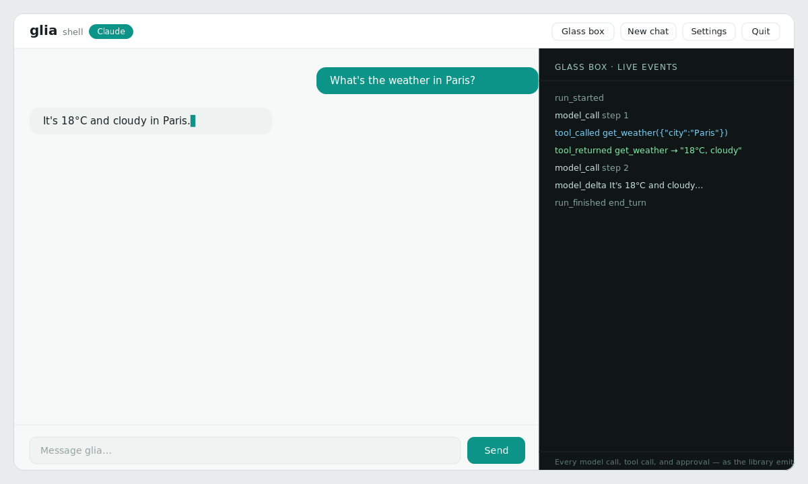

# Desktop app

glia ships a small **graphical shell** — a chat window that also shows the live
glass box (streaming tokens, tool calls, approvals) as it happens. It runs a real
`glia.Agent` under the hood, so it doubles as a demo of the library.



## Two ways to get it

### 1. Download a binary (no Python needed)

Grab the standalone build for your OS from the
[latest release](https://github.com/DenisDrobyshev/glia/releases/latest):

- `glia-shell-windows.exe`
- `glia-shell-macos`
- `glia-shell-linux`

Double-click it (or run it from a terminal). It starts a local server and opens
the app in your browser. Nothing is uploaded anywhere — everything runs on your
machine.

### 2. Install from PyPI (native window)

```bash
pip install "glia-agents[shell]"
glia-shell
```

Installed this way, the app opens in a **native desktop window** (via pywebview),
falling back to your browser if a window backend isn't available. Use
`glia-shell --web` to force browser mode.

## Using it

- **Works offline out of the box.** In *demo* mode it echoes your messages back,
  so you can try the interface and watch the event stream with zero setup.
- **Run a local model — free.** In **Settings**, choose **Ollama**, set the model
  (e.g. `qwen2.5` or `deepseek-r1`) and host, and save. With
  [Ollama](https://ollama.com) installed and the model pulled
  (`ollama pull qwen2.5`), everything runs locally on your machine — no key, no
  network.
- **Add a key for real Claude.** Open **Settings**, choose **Claude**, paste your
  Anthropic API key (it's stored locally in your config directory and never sent
  back to the UI), pick a model, and save. Now messages go to Claude, and the two
  demo tools (`current_time`, `word_count`) show up in the glass box when used.
- **The glass box** on the right lists every event exactly as the library emits
  it — `model_call`, `model_delta`, `tool_called`, `tool_returned`,
  `approval_resolved`, `run_finished`. Toggle it with the *Glass box* button.
- **New chat** starts a fresh conversation; **Quit** stops the local server.

## How it's built

The shell is deliberately thin and dependency-light:

- The server is **pure Python standard library** (`http.server`) — no web
  framework. Chat replies stream over Server-Sent Events.
- The UI is a **single self-contained HTML file** (no build step).
- The only optional dependency is `pywebview`, and only for the native window;
  the downloadable binaries run in browser mode with zero third-party deps.

In other words, the app is itself a glass box — you can read all of it under
`glia/shell/`.
